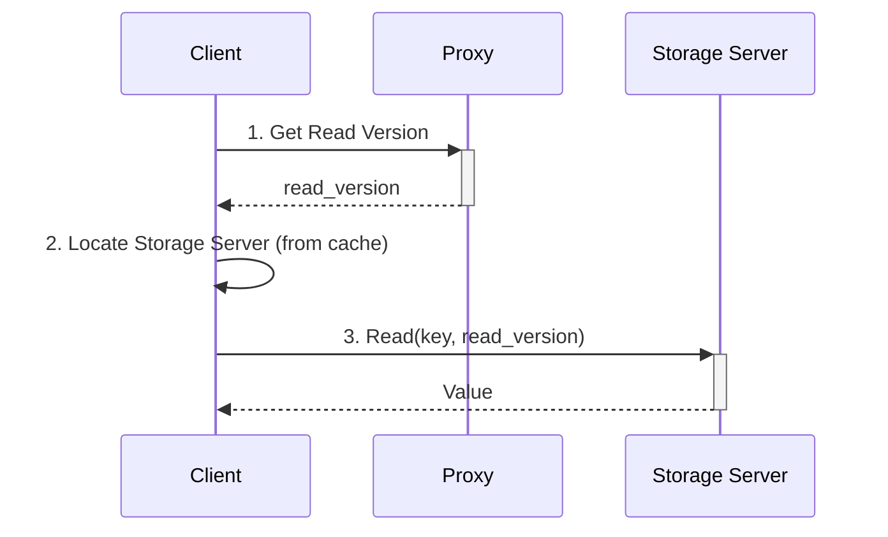

# The Read Path

<!-- toc -->

FoundationDB's read path is designed to be highly scalable and efficient. Unlike the write path, which is coordinated through a central set of proxies, the read path is almost entirely decentralized. This allows the cluster to serve a massive number of concurrent reads without creating bottlenecks.

Here is a high-level overview of how a read operation works:

### The Steps of a Read

1.  **Get Read Version:** When a client begins a transaction, the first thing it does is request a **Read Version** from a **Proxy**. This version is a timestamp that represents a consistent, immutable snapshot of the entire database. All reads within the transaction will be served from this snapshot, which is the foundation of FoundationDB's snapshot isolation.

2.  **Locate the Storage Server:** The client library maintains a local cache that maps key ranges to the **Storage Servers** responsible for them. When the client needs to read a key, it uses this cache to determine which Storage Server to contact. This lookup is extremely fast and does not require a network round-trip.

3.  **Read from the Storage Server:** The client connects directly to the appropriate Storage Server and requests the value for the key at the transaction's Read Version. The Storage Server uses its in-memory B-tree and on-disk data files to find the correct version of the value and return it to the client.

### Key Takeaways

*   **Decentralized and Scalable:** Because clients read directly from Storage Servers, read throughput can be scaled horizontally simply by adding more Storage Servers to the cluster.
*   **Snapshot Isolation:** The use of a Read Version ensures that a transaction sees a perfectly consistent view of the database, even as other transactions are being committed concurrently. Your reads are never "dirty."
*   **Low Latency:** By caching the mapping of keys to Storage Servers, the client can avoid extra network hops and read data with very low latency.
