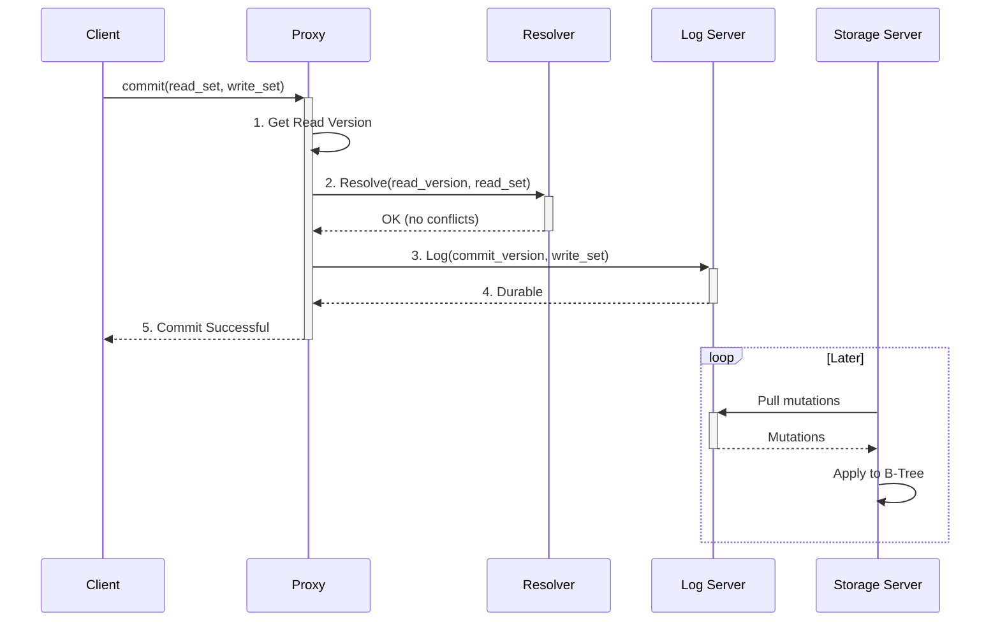

# The Write Path

<!-- toc -->

Understanding the life of a write transaction is key to understanding how FoundationDB provides its powerful guarantees of strict serializability and durability. The process involves a carefully choreographed dance between several cluster roles.

Let's walk through the journey of a transaction from the moment a client calls `commit()` to the point where it is safely stored in the database.

### The Steps of a Commit

1.  **Get Read Version:** When the transaction is ready to be committed, the client library sends it to a **Proxy**. The first thing the Proxy does is request a **Read Version** from the Cluster Controller. This version number establishes the logical point in time at which the transaction's reads occurred.

2.  **Conflict Resolution:** The Proxy sends the transaction's Read Version and its *read set* (the list of keys it read) to the **Resolver**. The Resolver checks if any of the keys in the read set have been written to by another transaction that committed *after* this transaction's Read Version. If a conflict is detected, the Resolver tells the Proxy to reject the transaction, and the client must retry.

3.  **Logging for Durability:** If the Resolver finds no conflicts, the Proxy assigns the transaction a **Commit Version** (which will be higher than its Read Version) and sends the transaction's *write set* (the keys and values to be written) to the **Log Servers**.

4.  **Durable Commit:** The Log Servers write the transaction's mutations to their durable, on-disk transaction logs. Once a quorum of Log Servers has confirmed that the data is safely on disk, they respond to the Proxy. At this point, the transaction is considered **durable**. Even if the entire cluster lost power, the transaction would be recovered.

5.  **Success!** The Proxy, having received confirmation from the Log Servers, reports back to the client that the commit was successful.

### The Final Step: Data Storage

Notice that the **Storage Servers** were not involved in the critical commit path. This is a key design decision that makes commits extremely fast.

After the transaction is durable, the Storage Servers will eventually pull the new data from the Log Servers and apply the mutations to their own on-disk B-trees. This process happens asynchronously in the background and does not block new incoming transactions. This separation of the transaction log from the primary data store is a pattern known as Command Query Responsibility Segregation (CQRS) and is fundamental to FoundationDB's performance.
