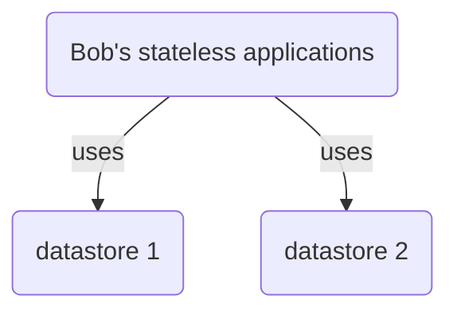
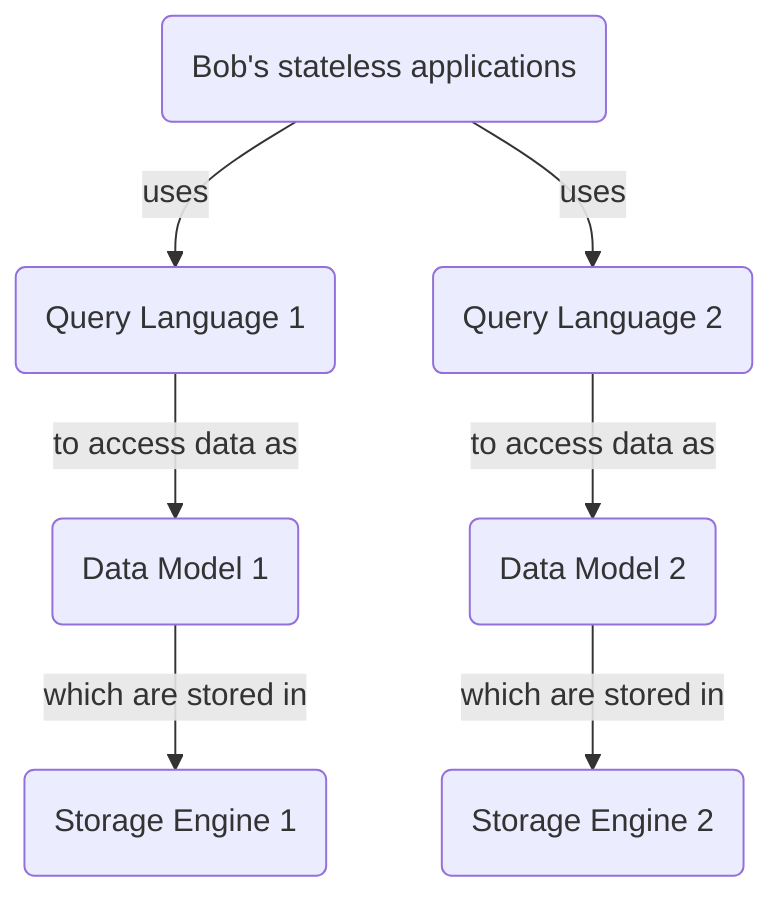
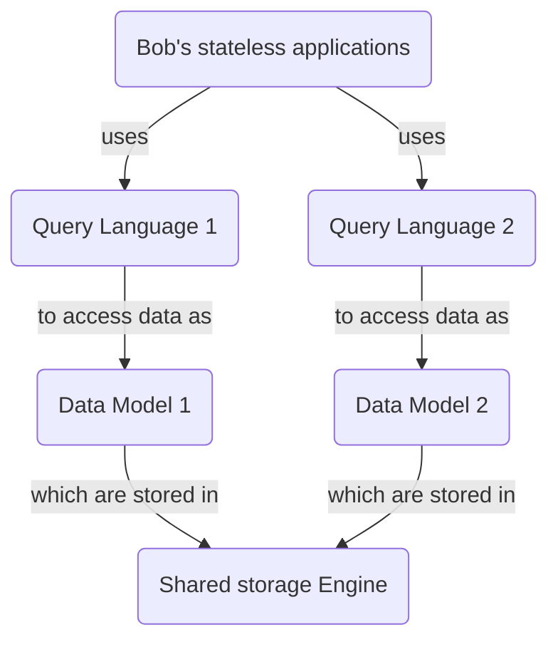

# Yet another database?

> Another database? There is so many of them 😑

You are right, we are living in the golden age of data, and as such, we have many options to store our data.

According to the [Database of Databases](https://dbdb.io/), you can choose between **795 database management systems**. Yes, you read it right, almost 800 different databases to compare 😱

## How to choose a database?

If you click on the [Browse button](https://dbdb.io/browse), you will be able to go through the different criteria:

* is it open-source or not?
* is it an embedded/single-node/distributed database?
* What is the query language?
* is it suited for [OTLP](https://en.wikipedia.org/wiki/Online_transaction_processing) or [OLAP](https://en.wikipedia.org/wiki/Online_analytical_processing) workloads?
* What is the data model?
* What is the scalability limits?
* Is it transactional?
* Is there indexes?
* Is it a row-oriented storage, or maybe columnar?
* is there stored procedures and materialized views?
* and so on.

That's a lot of criteria! But that means we also have a big number of possible combinations, each one creating a potential new database. This is why we have **specialized datastores** like:

* document
* column 
* key-value
* graph 
* indexing
* messaging
* and others!

## Stateless applications

This variety of specialized datastore is allowing developers to have multiple datastores as **requirements** for a single infrastructure.

> Alice: "Hey Bob, what do you need for your next project?"
> 
> Bob: "Mmmmh, I will need an SQL database and a messaging systems 🤔".

Storing data is hard, so we are using them as **durable** strongholds for our data, while making our applications mostly **stateless**.

So, Bob's architecture looks like this:

## Datastore's architecture

We said earlier that there is a lot of criteria to choose a database, but we can narrow to 3: 

* What is the **Query language**,
* What is the **data model**,
* What is the **Storage Engine**.

For example, PostgreSQL is exposing relational data through the SQL language and storing files on a single node. 

Let's update the flowchart:

Document databases, column-oriented, row-oriented, JSON, key-value, etc. all make sense in the right context, and often different parts of an application call for different choices. That means we cannot mutualize the Query language and the data models. That leaves the storage engine.

## Sharing the storage engine 🤔

Let's mutualize the storage Engine!

This design has some great advantages:

* the storage engine *only need to focus* on storage,
* any components above the storage Engine **has become stateless**.

That could work, but if we have put a lot of contraints on the storage engine, let's talk about what we require. 

## Requirements for such a storage engine

So, we know have a storage engines that needs to handle multiple types of data. To be cloud-Native, the storage engine needs to be:

* fault tolerant,
* scalable,
* highly available.

while providing:

* strong semantics,
* flexible data models.

Now the question is: **can we design such a storage engine?** The answer is **yes**, and it is called FoundationDB.