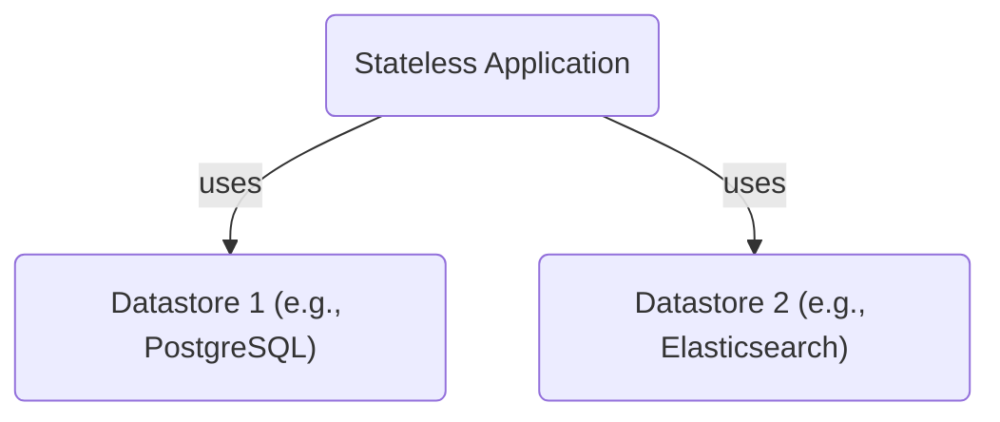
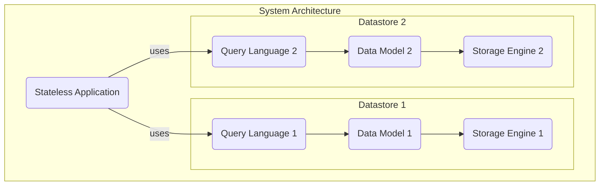
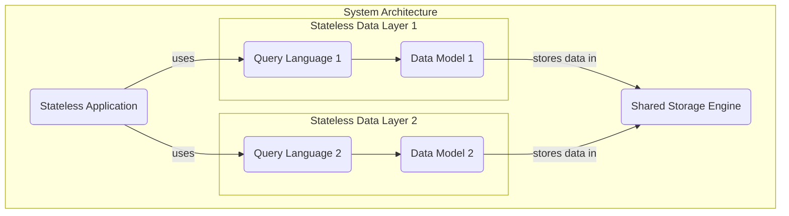

# Yet Another Database?

<!-- toc -->

> "Another database? There are so many of them!"

You're right. We live in a golden age of data, which means we have a dizzying number of options for storing it.

According to the [Database of Databases](https://dbdb.io/), there are nearly **800 different database management systems** to choose from. This abundance of choice can be overwhelming.

## How Are Databases Different?

When choosing a database, engineers evaluate them against a long list of criteria. This leads to a wide variety of **specialized datastores**, each optimized for a different purpose. Key differentiators include:

*   **Data Model:** Is it a document, column-family, key-value, graph, or relational database?
*   **Workload:** Is it designed for transactional (OLTP) or analytical (OLAP) workloads?
*   **Architecture:** Is it embedded, single-node, or distributed?
*   **Transactions:** Does it support ACID transactions?
*   **Query Language:** Does it use SQL or a proprietary language?
*   **Scalability:** What are its performance limits?
*   **Licensing:** Is it open-source?
*   **Features:** Does it offer secondary indexes, stored procedures, or materialized views?

## The Rise of Polyglot Persistence

This variety of specialized datastores leads developers to use multiple databases in a single application—a pattern sometimes called "polyglot persistence."

For example, a project might require both a relational database for transactional data and a dedicated search index for text search.

Because managing state is complex, a common architectural pattern is to build **stateless applications** that delegate the complexity of data storage to these specialized, stateful databases.

A typical architecture might look like this:

## The Anatomy of a Datastore

While databases differ in many ways, we can simplify their architecture into three core components:

*   The **Query Language:** The interface for interacting with the data.
*   The **Data Model:** The way the data is structured and presented (e.g., relational, document).
*   The **Storage Engine:** The underlying component responsible for durably storing and retrieving data on disk.

For example, PostgreSQL exposes a relational data model via the SQL query language, all running on a storage engine designed for a single node.

Let's update our diagram to show this breakdown:

While the query language and data model are often specialized for a particular use case, what if we could consolidate the storage layer?

## The Case for a Shared Storage Engine

Let's imagine we could use a single, powerful storage engine for all our data models.

This design has powerful advantages:

*   **Operational Simplicity:** We only need to manage, scale, and back up one underlying storage system.
*   **Stateless Components:** The layers that provide the data models and query languages can themselves become stateless, simplifying their development and deployment.

However, this places a heavy burden on the shared storage engine. What would it need to provide?

## Requirements for a Universal Storage Engine

To be a viable foundation for modern, cloud-native applications, such an engine must be:

*   **Scalable, Fault-Tolerant, and Highly Available:** It must handle growing workloads and survive hardware failures without downtime.
*   **Transactional:** It must provide strong consistency guarantees (like ACID) to allow developers to reason about their data correctly.
*   **Unopinionated:** It should impose a minimal, flexible data model (like an ordered key-value store) to support various data structures on top.

Can such a storage engine exist? **Yes.** It's called FoundationDB.