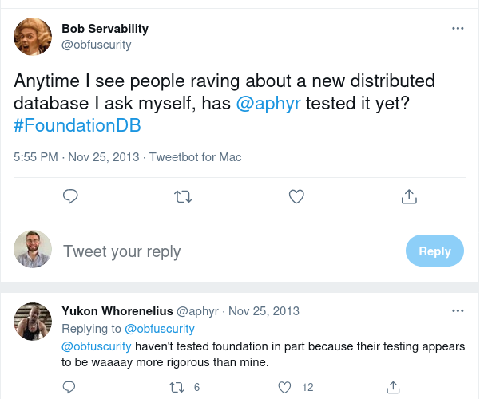

# Correct and robust, choose both

<!-- toc -->

FoundationDB is famously known in the distributed system's community for the simulation framework they developed, unmatched in the industry. In this section, we will go through why FoundationDB is one of the most robust distributed database available.

## Jepsen

First, let's introduce [Jepsen](http://jepsen.io/):

> Jepsen is an effort to improve the safety of distributed databases, queues, consensus systems, etc. We maintain an open source software library for systems testing, as well as blog posts and conference talks exploring particular systems’ failure modes. In each analysis we explore whether the system lives up to its documentation’s claims, file new bugs, and suggest recommendations for operators.

> Jepsen pushes vendors to make accurate claims and test their software rigorously, helps users choose databases and queues that fit their needs, and teaches engineers how to evaluate distributed systems correctness for themselves.

Jepsen is now a standard for testing databases, but there is no FoundationDB analysis:



## Flow programming language

Let's dive in the testing part of FoundationDB, starting with Flow. let's quote the [Engineering page](https://apple.github.io/foundationdb/engineering.html):

> FoundationDB began with ambitious goals for both high performance per node and scalability. We knew that to achieve these goals we would face serious engineering challenges that would require tool breakthroughs. We’d need efficient asynchronous communicating processes like in Erlang or the Async in .NET, but we’d also need the raw speed, I/O efficiency, and control of C++. To meet these challenges, we developed several new tools, the most important of which is **Flow**, a new programming language that brings actor-based concurrency to C++11.

Flow is more of a **stateful distributed system framework** than an asynchronous library. It takes a number of highly opinionated stances on how the overall distributed system should be written, and isn’t trying to be a widely reusable building block.

> Flow adds about 10 keywords to C++11 and is technically a trans-compiler: the Flow compiler reads Flow code and compiles it down to raw C++11, which is then compiled to a native binary with a traditional toolchain.

Flow was developed before FDB, as stated in this [2013's post](https://news.ycombinator.com/item?id=5319163):

> FoundationDB founder here. Flow sounds crazy. What hubris to think that you need a new programming language for your project? Three years later: Best decision we ever made.

> We knew this was going to be a long project so we invested heavily in tools at the beginning. The first two weeks of FoundationDB were building this new programming language to give us the speed of C++ with high level tools for actor-model concurrency. But, the real magic is how Flow enables us to use our real code to do deterministic simulations of a cluster in a single thread. We have a white paper upcoming on this.

> We've had quite a bit of interest in Flow over the years and I've given several talks on it at meetups/conferences. We've always thought about open-sourcing it... It's not as elegant as some other actor-model languages like Scala or Erlang (see: C++) but it's nice and fast at run-time and really helps productivity vs. writing callbacks, etc.

> (Fun fact: We've only ever found two bugs in Flow. After the first, we decided that we never wanted a bug again in our programming language. So, we built a program in Python that generates random Flow code and independently-executes it to validate Flow's behavior. This fuzz tester found one more bug, and we've never found another.)

A very good overview of Flow is available [here](https://apple.github.io/foundationdb/flow.html) and some details [here](https://forums.foundationdb.org/t/why-was-flow-developed/1711/3).

## Simulation-Driven development

One of Flow’s most important job is enabling **Simulation**:

> We wanted FoundationDB to survive failures of machines, networks, disks, clocks, racks, data centers, file systems, etc., so we created a simulation framework closely tied to Flow. By replacing physical interfaces with shims, replacing the main epoll-based run loop with a time-based simulation, and running multiple logical processes as concurrent Flow Actors, Simulation is able to conduct a deterministic simulation of an entire FoundationDB cluster within a single-thread! Even better, we are able to execute this simulation in a deterministic way, enabling us to reproduce problems and add instrumentation ex post facto. This incredible capability enabled us to build FoundationDB exclusively in simulation for the first 18 months and ensure exceptional fault tolerance long before it sent its first real network packet. For a database with as strong a contract as the FoundationDB, testing is crucial, and over the years we have run the equivalent of a trillion CPU-hours of simulated stress testing.

A good overview of the simulation can be found [here](https://apple.github.io/foundationdb/testing.html). 

You can also have a look at those two awesome talk:

<iframe width="560" height="315" src="https://www.youtube.com/embed/4fFDFbi3toc" title="YouTube video player" frameborder="0" allow="accelerometer; autoplay; clipboard-write; encrypted-media; gyroscope; picture-in-picture" allowfullscreen></iframe>

<iframe width="560" height="315" src="https://www.youtube.com/embed/fFSPwJFXVlw" title="YouTube video player" frameborder="0" allow="accelerometer; autoplay; clipboard-write; encrypted-media; gyroscope; picture-in-picture" allowfullscreen></iframe>

Simulation has been made possible by combining:

* Single-threaded pseudo-concurrency,
* Simulated implementation of all external communication,
* determinism.

Here's an example of a [testfile](https://github.com/apple/foundationdb/blob/master/tests/slow/SwizzledCycleTest.toml):

```toml
[[test]]
testTitle = 'SwizzledCycleTest'

    # Goal of the test
    [[test.workload]]
    testName = 'Cycle'
    transactionsPerSecond = 5000.0
    testDuration = 30.0
    expectedRate = 0.01

    # What will be done concurrently to prevent the goal

    # random clogging
    [[test.workload]]
    testName = 'RandomClogging'
    testDuration = 30.0
    swizzle = 1

    # reboot machines
    [[test.workload]]
    testName = 'Attrition'
    machinesToKill = 10
    machinesToLeave = 3
    reboot = true
    testDuration = 30.0

    [[test.workload]]
    testName = 'Attrition'
    machinesToKill = 10
    machinesToLeave = 3
    reboot = true
    testDuration = 30.0
    
    # Change configuration to trigger a coordination changes
    [[test.workload]]
    testName = 'ChangeConfig'
    maxDelayBeforeChange = 30.0
    coordinators = 'auto'
```

The test is splitted into two parts:

* **The goal**, for example doing transaction pointing to another with thousands of transactions per sec and there should be only 0.01% of success.
* **What will be done to try to prevent the test to succeed**. In this example it will **at the same time**:

    * do random clogging. Which means that **network connections will be stopped** (preventing actors to send and receive packets). Swizzle flag means that a subset of network connections will be stopped and bring back in reverse order, 😳
    * will **poweroff/reboot machines** (attritions) pseudo-randomly while keeping a minimal of three machines, 🤯
    * **change configuration**, which means a coordination changes through multi-paxos for the whole cluster. 😱

Keep in mind that all these failures will appears **at the same time!** Do you think that your current **datastore has gone through the same test on a daily basis?** [I think not](https://github.com/etcd-io/etcd/pull/11308).

Everything is seed-driven, which means that if a faulty seed is found, you can reproduce the bug locally. For example, if the seed `1094093328` is in error, you can just run `./fdbserver -r simulation -f ./SwizzledCycleTest.toml -b on -s 1094093328`:

<script id="asciicast-aYxsjrHRuQLQiHuMVaNWYLAxo" src="https://asciinema.org/a/aYxsjrHRuQLQiHuMVaNWYLAxo.js" async></script>

Everything is deterministic, from the errors, how much time RPCs will take, and even which actor is scheduled.

## Cooperating with the simulation framework with Buggify

Having a simulation framework is not enough, and one important aspects of the simulation is called Buggify. It is well explained in [this blogpost](https://transactional.blog/simulation/buggify.html):

> A deterministic simulation framework with random fault injection provides a testing framework that can find bugs. However, the question is how quickly? If validating the correctness of a network protocol or storage engine, then network or disk fault injection alone would be sufficient to give a high degree of confidence in correctness. The types of dangerous conditions that the code must correctly handle, such as network instability or disk corruption, exactly match what the simulator directly produces.
>
> How FoundationDB does this is with the BUGGIFY macro. BUGGIFY exists to bias the simulator towards doing dangerous, bug-finding things. It is the main tool that differentiates FDB’s simulation testing from other black box solutions. Instead of writing FoundationDB and then trying to validated it against a separate blackbox testing solution afterwards, FoundationDB was written to explicitly cooperate with the simulator by instrumenting its code with descriptions of how to cause failures in each component of the system.
> 
> BUGGIFY has the following rules:
> 
> * BUGGIFY only ever evaluates to true when run in simulation.
>
> * The first time each BUGGIFY use is evaluated, it is either enabled or disabled for the entire simulation run.
>
> * Enabled uses of BUGGIFY have a 25% chance of evaluating to true (or custom, e.g. BUGGIFY_WITH_PROB(0.001) == 0.1% chance).

`BUGGIFY` is allowing FDB developers to inject [deterministic delays](https://github.com/apple/foundationdb/blob/07e531947765696c3d0e80703967dd5da420fb28/fdbserver/TLogServer.actor.cpp#L1252-L1256):

```cpp
	if (!self->spillOrder.size()) {
		wait(delay(BUGGIFY ? SERVER_KNOBS->BUGGIFY_TLOG_STORAGE_MIN_UPDATE_INTERVAL
		                   : SERVER_KNOBS->TLOG_STORAGE_MIN_UPDATE_INTERVAL,
		           TaskPriority::UpdateStorage));
		return Void();
	}

```

Or failures like [bitsFlip](https://github.com/apple/foundationdb/blob/main/fdbrpc/FlowTransport.actor.cpp#L1021-L1027) on RPC calls:

```cpp
if (g_network->isSimulated() &&
			g_network->now() - g_simulator.lastConnectionFailure > g_simulator.connectionFailuresDisableDuration &&
			BUGGIFY_WITH_PROB(0.0001)) {
				g_simulator.lastConnectionFailure = g_network->now();
				isBuggifyEnabled = true;
				TraceEvent(SevInfo, "BitsFlip").log();
				int flipBits = 32 - (int)floor(log2(deterministicRandom()->randomUInt32()));

				uint32_t firstFlipByteLocation = deterministicRandom()->randomUInt32() % packetLen;
```


## Implications for CI

Having such a powerful testing environment means that every FDB developer can concentrate on the code, and CI will try to brute-force your code. This has two major consequences:

* Typically run 100k simulation tests for each PR before reviewing(500 cores for about two hours)
* Critical code require millions of correctness tests.


## TL;DR

> "Simulation’s success has surpassed our expectation and has been vital to our engineering team."
> 
> "It seems unlikely that we would have been able to build FoundationDB without this technology."

We can also quote [Will Wilson](https://youtu.be/fFSPwJFXVlw):

> The reason why people write tests is because human beings are astonishingly bad at thinking through all the possible branches of control flow that a program could take.
>
> But that very fact means that we're unable to write tests to cover all the things that we actually need to cover, like because if we could, if we were smart enough, or had the right kind of brain to write all the tests we needed to write, then we would have just written the code correctly in the first place.
>
> I think this is like really scary and really true, and the implications is that tests can be useful for turning up regressions, but almost completely useless for telling you about unknown unknowns.
>
> I think this is the real secret sauce behind what FoundationDB did, it's not so much the deterministic simulation although that was a very important part of it. It was that whenever we had a new piece of functionality, we didn't say "how can I write some tests to cover this?". It was more like "how can I write a system that will forever be generating new and interesting tests?"

