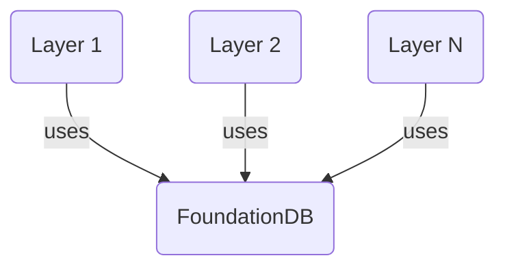

# Enter FoundationDB

<!-- toc -->

Let's start by quoting the [official overview](https://apple.github.io/foundationdb/):

> FoundationDB is a distributed database designed to handle large volumes of structured data across clusters of commodity servers. It organizes data as an ordered key-value store and employs ACID transactions for all operations. It is especially well-suited for read/write workloads but also has excellent performance for write-intensive workloads.

FoundationDB is an open-source(Apache V2), distributed key-value store written in Flow, an async-first language that targets C++ specially developed for the database. 

Like all key-value stores, it looks like an infinite dictionary/map from programming, allowing you to store key and values in bytes. 

Keys are lexicographic order, which means:

* ``'0'`` is sorted before ``'1'``
* ``'apple'`` is sorted before ``'banana'``
* ``'apple'`` is sorted before ``'apple123'``
* keys starting with ``'mytable\'`` are sorted together (e.g. ``'mytable\row1'``, ``'mytable\row2'``, ...)

One huge advantage of FDB is that it supports **multi-key strictly serializable transactions**. Let's break-down the words in reverse order:

* **transactions**: All reads and writes in FoundationDB are accomplished using transactions. These transactions are fully ACID (Atomic, Consistent, Isolated, and Durable) and span across multiple machines with high performance.
* **Serializable**: this means that the outcome of concurrent transaction is equal to a serial execution.
* **Strictly**: transactions are strictly ordered
* **Multi-key**: you can write across regions/shards

The full list of features is available [here](https://apple.github.io/foundationdb/features.html), and you will also finds a [anti-features list](https://apple.github.io/foundationdb/anti-features.html).

## FoundationDB as a database

FoundationDB provides amazing performance on commodity hardware, allowing you to support very heavy loads at low cost. The official [performance page](https://apple.github.io/foundationdb/performance.html) is giving us some insights:

> Here, a cluster of commodity hardware scales to 8.2 million operations/sec doing a 90% read and 10% write workload with 16 byte keys and values between 8 and 100 bytes. 

You can expect sub-millisecond performance for small reads, without any tuning.

Beside having huge performance, FoundationDB is  easy to **install, grow, manage and fault tolerant**. It has been running in production for years in companies like Apple or Snowflake. Backing FoundationDB up is an unmatched testing system based on a **deterministic simulation engine** that will be described later in the book.

## FoundationDB as a database-framework

For developers, FoundationDB can be seen as a **database-framework**: it decouples its data storage technology from its data model, allowing you to write **"layers"**: stateless applications that will use FoundationDB as their storage.

Each layer can expose high level data models. They can be developed as libraries or stateless services. And because of FDB performance, they are easy to scale.

## A brief history of FoundationDB

FoundationDB started first as a company in 2009. The FoundationDB Alpha program began in January 2012 and concluded on March 4, 2013 with their public Beta release.

Their 1.0 version was released for general availability on August 20, 2013. On March 24, 2015 it was reported that Apple has acquired the company.

On April 19, 2018, Apple open sourced the software, releasing it under the Apache 2.0 license.

## Who is using FoundationDB?

Many companies are using FDB, including:

* **Apple iCloud**: they are the largest users. Billions of logical databases are stored in FDB (one per user per application). You will find more details about this on the Record-layer chapter.
* **Snowflake** is storing all their metadatas in FDB,
* **VMWare** Tanzu (Formerly Wavefront),
* **IBM** (Apache CouchDB),
* **eBay**,
* **Epic Games**,
* ...

## TL;DR

FoundationDB is a scalable, robust, distributed key-value store that you can use as a framework to write your own ~~database~~ layer 🤯