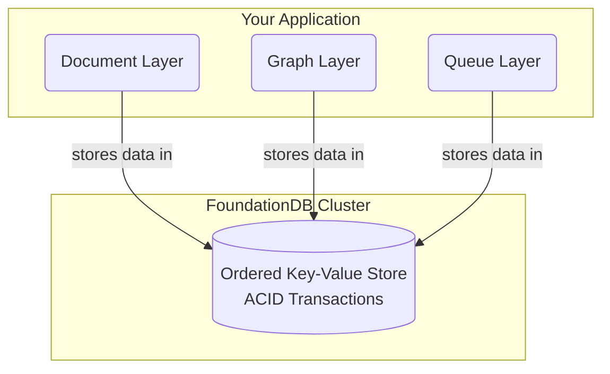

# Enter FoundationDB

<!-- toc -->

As the [official overview](https://apple.github.io/foundationdb/) puts it:

> FoundationDB is a distributed database designed to handle large volumes of structured data across clusters of commodity servers. It organizes data as an ordered key-value store and employs ACID transactions for all operations. It is especially well-suited for read/write workloads but also has excellent performance for write-intensive workloads.

Let's unpack what makes FoundationDB unique.

## The Core: An Ordered, Transactional Key-Value Store

At its heart, FoundationDB is a distributed, open-source (Apache 2.0) key-value store. Think of it as a massive, sorted dictionary where both keys and values are simple byte strings.

The keys are stored in lexicographical order, which means you can efficiently scan ranges of keys. This simple but powerful feature is the basis for building complex data models. For example:

*   `'user:alice'` comes before `'user:bob'`
*   `'user:bob'` comes before `'user:bob:profile'`
*   All keys prefixed with `'table1:'` are grouped together, allowing you to simulate rows in a table.

### Multi-Key ACID Transactions

The most important feature of FoundationDB is its support for **multi-key, strictly serializable transactions**. This is a rare and powerful guarantee for a distributed database.

*   **Transactions:** All operations, including reads and writes, are performed within a transaction. These transactions are fully ACID (Atomic, Consistent, Isolated, and Durable), even across multiple machines.
*   **Multi-Key:** A single transaction can read and write multiple, unrelated keys, no matter where they are stored in the cluster.
*   **Strictly Serializable:** This is the strongest isolation level. It ensures that the result of concurrent transactions is equivalent to them running one at a time in some sequential order. This makes writing correct applications dramatically simpler, as you are protected from a wide range of subtle race conditions.

You can find a full list of [features](https://apple.github.io/foundationdb/features.html) and, just as importantly, [anti-features](https://apple.github.io/foundationdb/anti-features.html) in the official documentation.

## The Powerhouse: Performance and Reliability

FoundationDB is not just a theoretical model; it's a battle-tested engine built for performance and reliability on commodity hardware.

*   **Performance:** It delivers linear scalability and high performance, often achieving millions of operations per second on a cluster. You can expect sub-millisecond latencies for many workloads without any special tuning.
*   **Reliability:** It is designed to be fault-tolerant, easy to manage, and simple to grow. Its reliability is backed by an unmatched testing system based on a **deterministic simulation engine**, which we will explore later in this book.

> A cluster of commodity hardware scaling to 8.2 million operations/sec on a 90% read, 10% write workload.

## The Ecosystem: A Foundation for Layers

Because FoundationDB provides such a powerful and reliable core, it can serve as a universal storage engine—a foundation for building other data models. These are called **"layers."**

A layer is a stateless component that maps a high-level data model (like a document, graph, or relational model) to FoundationDB's simple key-value model.

This architecture decouples the data model from data storage, allowing developers to focus on building features without reinventing the complexities of a distributed database.

## A Brief History

FoundationDB began as a company in 2009. After a successful beta program, version 1.0 was released in 2013. Apple acquired the company in 2015 and subsequently open-sourced the project under the Apache 2.0 license in 2018, making it available to the wider community.

## Who Uses FoundationDB?

FoundationDB is the storage engine behind critical systems at major technology companies, including:

*   **Apple:** A massive-scale deployment for iCloud, where it stores billions of logical databases.
*   **Snowflake:** Stores all metadata for its cloud data platform.
*   **VMware:** Used in the Tanzu observability platform.
*   And many others, including **IBM**, **eBay**, and **Epic Games**.

## TL;DR

FoundationDB is a scalable, distributed key-value store with strictly serializable ACID transactions. It's so powerful and reliable that it serves as a universal foundation for building any data model you can imagine.